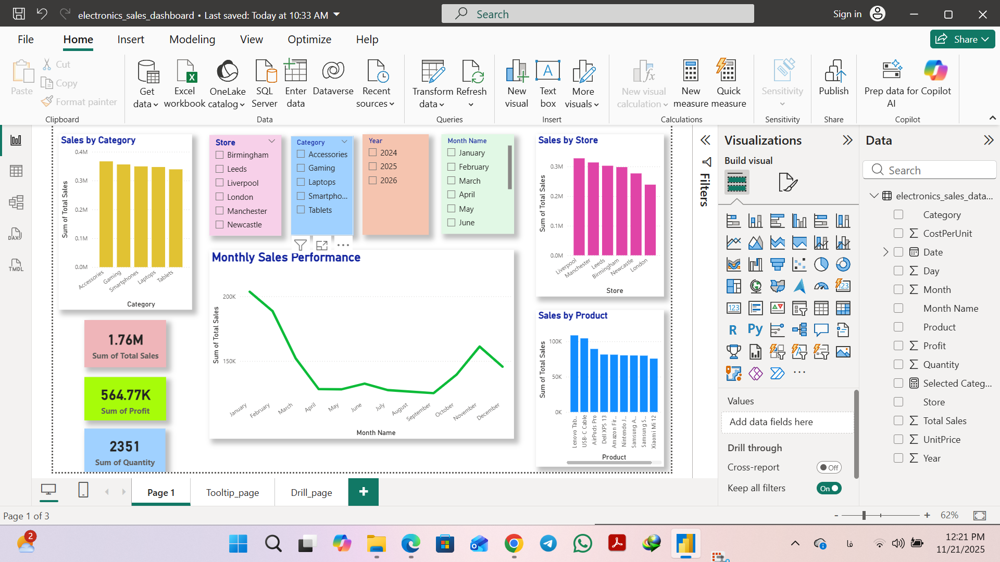
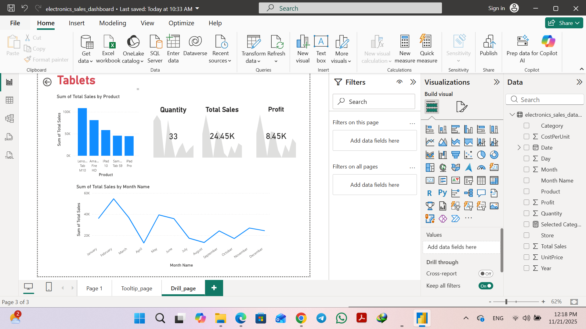
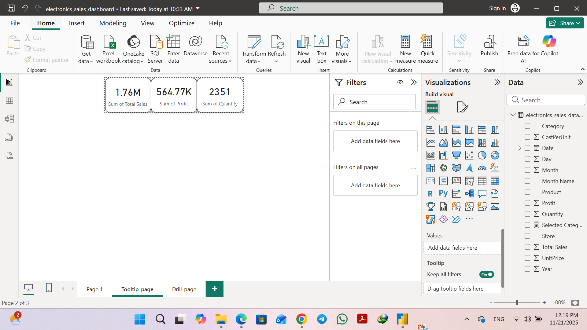

# 📊 Electronics Sales Dashboard  
**An Interactive Power BI Dashboard with Drill-through, Custom Tooltips, and Data Cleaning**

This project demonstrates a complete end-to-end **data analytics workflow** using **Power BI**, including data cleaning, modeling, dashboard design, advanced interactions, and storytelling.  
It uses a synthetic dataset of electronics sales across different cities, product categories, and months of the year.

## 📁 Project Structure

electronics-sales-dashboard
│
├── electronics_sales_dashboard.pbix        # Main Power BI report
├── raw_data.csv                            # Raw imported dataset
│
├── screenshots/                            # Dashboard preview images
│   ├── main_dashboard.png
│   ├── drillthrough_pag_

## 🧹 1. Data Cleaning (Power Query)

Data preparation was done using **Power Query**:

✔ Trimmed texts  
✔ Removed errors  
✔ Replaced NULL values  
✔ Standardized data types  
✔ Created time features (Year, Month, Month Name, Day)

Then the cleaned data was loaded into the data model.

## 📊 2. Dashboard Features

### 🔹 Main Dashboard
- Monthly sales performance (line chart)
- Sales by store (bar chart)
- Sales by category
- Sales by product (Top 10)
- KPI cards:
  - Total Sales
  - Total Profit
  - Total Quantity
- Slicers:
  - Store
  - Category
  - Year
  - Month

## 🎯 3. Drill-Through Page

A dedicated **drillthrough page** provides deeper insights into each **Category**.

✔ Activated "Keep all filters"  
✔ Category is used as the drillthrough field  
✔ Visual breakdown includes:
- Quantity over time  
- Total Sales trend  
- Profit trend  
- Best-selling products within the selected category  

Each selection from the main dashboard filters this page automatically.

## 🏷 4. Custom Tooltip Page

A small canvas (320×280) is used to show:

- Total Sales  
- Profit  
- Quantity  
- Small trend line  
- Category name  

Hovering on charts in the main dashboard displays this detailed tooltip.

## 🖼 5. Screenshots

### ⭐ Main Dashboard  

### ⭐ Drillthrough Page  

### ⭐ Tooltip Page  

## 🛠 Tools Used

- Power BI Desktop  
- Power Query  
- DAX  
- GitHub  
- Excel  

## 👩‍💻 Author

**Forough Moosavi**  
📧 Email: forooghmousavi1371@gmail.com  
🔗 GitHub: https://github.com/Forough-Moosavi  

## ⭐ Support

You can support this project by starring ⭐ the repository.
